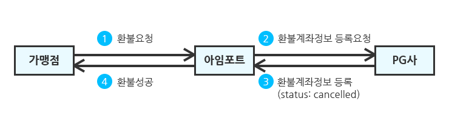

# 💷 가상계좌 환불하기

### 가상계좌 환불을 위해서는 PG사 **가상계좌 특약서비스**에 가입되어 있어야 합니다.


**가상계좌 특약서비스에 가입해야 하는 이유**

신용카드와는 달리 가상계좌의 경우 결제/환불에 대한 수수료는 환불대상에서 제외됩니다.예를 들어 10,000원 결제건에 대해서 가맹점은

* 결제 시, 9,700원(10,000원 - 가상계좌 발행 수수료 300원)을 PG사로부터 정산받습니다.
* 환불 시, 10,300원(환불되어야할 10,000원 + 환불 계좌로의 송금 수수료 300원)을 PG사로 지불합니다.

PG사는 이런 과정에서 발생할 수 있는 혼란을 미연에 방지하고자 **가상계좌 특약서비스에 가입한 가맹점에 한해서만 가상계좌 환불을 제공**하고 있습니다.


가상계좌의 경우 단방향 결제수단이여서 환불 대상을 알 수 없으므로 환불 금액 외에 다음의 환불 수령계좌 정보를 입력해야 합니다.

* `refund_holder`: 환불 수령계좌 예금주
* `refund_account`: 활불 수령계좌 번호
* `refund_bank`: 환불 수령계좌 은행코드


**가상계좌 은행코드는 PG사에 따라 다릅니다**

&#x20;**** `은행코드는`같은 은행이더라도 PG사에 따라 상이하므로 [**은행코드**](../../tip/pg-1.md)표에서 은행코드를 확인해 주세요


#### 아래는 가상계좌 환불을 요청하는 예제입니다.


```javascript
/* ... 중략 ... */
  app.post('/payments/cancel', async (req, res, next) => {
    try {
      /* 액세스 토큰(access token) 발급 */
      /* ... 중략 ... */
      /* 결제정보 조회 */
      const { body } = req;
      // 클라이언트로부터 전달받은 주문번호, 환불사유, 환불금액, 가상계좌 정보(예금주, 계좌번호, 은행코드)
      const { merchant_uid, reason, cancel_request_amount, refund_holder, refund_bank, refund_account } = body; 
      Payments.find({ merchant_uid }, async function(err, payment) { 
        /* ... 중략 ... */
        const paymentData = payment[0]; // 조회된 결제정보
        // 조회한 결제정보로부터 imp_uid, amount(결제금액), cancel_amount(환불된 총 금액) 추출
        const { imp_uid, amount, cancel_amount } = paymentData; 
        // 환불 가능 금액(= 결제금액 - 환불된 총 금액) 계산
        const cancelableAmount = amount - cancel_amount; 
        if (cancelableAmount <= 0) { // 이미 전액 환불된 경우
          return res.status(400).json({ message: "이미 전액환불된 주문입니다." });
        }
        ...
        /* 아임포트 REST API로 결제환불 요청 */
        const getCancelData = await axios({
          url: "https://api.iamport.kr/payments/cancel",
          method: "post",
          headers: {
            "Content-Type": "application/json",
            "Authorization": access_token // 아임포트 서버로부터 발급받은 엑세스 토큰
          },
          data: {
            reason, // 가맹점 클라이언트로부터 받은 환불사유
            imp_uid, // imp_uid를 환불 `unique key`로 입력
            amount: cancel_request_amount, // 가맹점 클라이언트로부터 받은 환불금액
            checksum: cancelableAmount, // [권장] 환불 가능 금액 입력
            refund_holder, // [가상계좌 환불시 필수입력] 환불 수령계좌 예금주
            refund_bank, // [가상계좌 환불시 필수입력] 환불 수령계좌 은행코드(ex. KG이니시스의 경우 신한은행은 88번)
            refund_account // [가상계좌 환불시 필수입력] 환불 수령계좌 번호
          }
        });
        const { response } = getCancelData.data; // 환불 결과
        /* 환불 결과 동기화 */
        ...
      });
    } catch (error) {
      res.status(400).send(error);
    }
  });
```


다음과 같이 가상계좌 환불을 요청하여 성공하면 PG사 담당자가 다음날 해당 계좌로 환불 금액을 입금합니다. 이는 통상적으로 영엽일 기준 하루 정도 소요됩니다.


