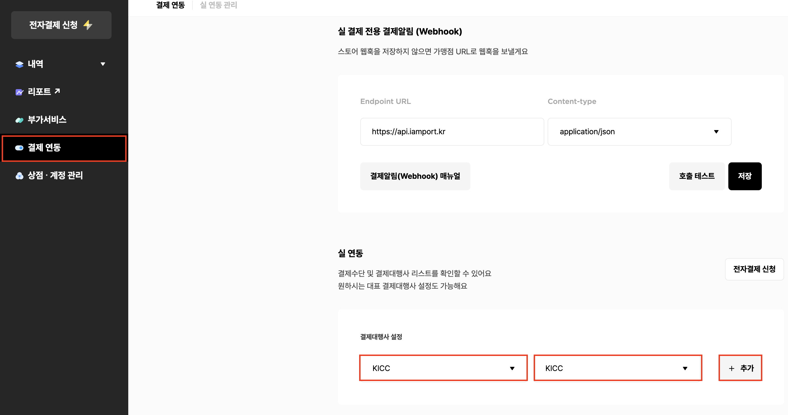

# ✔ 3. 연동정보 확인하기

결제창 연동 및 API 호출 시 필요한 연동정보를 확인할 수 있습니다.


해당 정보는 **결제내역을 컨트롤** 할수 있는 **민감 정보**이기 때문에 외부로 유출되지 않도록&#x20;

유의하시기 바랍니다.




* 차이포트에서 차이포트 관리자 콘솔 **계정당 고유하게 부여되는 값** 입니다.
* 결제창 호출시 **객체 초기화**에 사용하는 고유코드 입니다.
* **기술문의** 시 해당 코드값을 공유해주시면 빠르게 문제 해결을 도와 드릴수 있습니다.



* API 호출시 **Access Token** 발급을 위해 필요한 필수 값입니다.
* 해당 값은 **외부로 유출되지 않도록 각별히 유의**하셔야 합니다.



* API 호출시 **Access Token** 발급을 위해 필요한 필수 값입니다.
* 해당 값은 재 발급이 가능하며 주기적으로 재 발급을 통해 보안을 높일 수 있습니다.
* 해당 값은 **외부로 유출되지 않도록 각별히 유의**하셔야 합니다.



