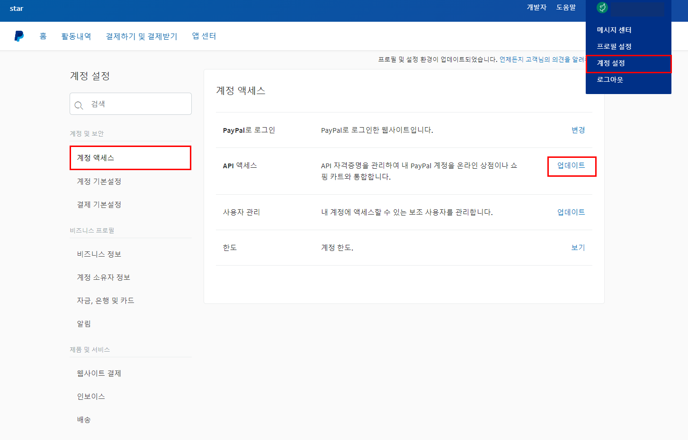

# 🛫 결제 연동 준비하기

## 1. 아임포트 회원가입 하기


결제창 연동을 진행하기 위해서는 아임포트 관리자페이지 [**회원가입**](https://admin.iamport.kr)이 선행 되어야 합니다.

아임포트 관리자 페이지는 **별도 계약없이** **무료** 회원가입이 가능합니다.


<a href="https://https/admin.iamport.kr"><strong>아임포트 회원가입 바로하러 가기</strong></a>

* 아임포트 회원가입은 "**이메일 주소"** 만 준비하시면 됩니다.
* 비밀번호는 쉽게 유추할수 없도록 “**복잡하게 설정**” 잊지마세요

아래와 같은 화면에서 [**회원가입**](https://www.iamport.kr/signup)을 클릭하여 진행해 주시면 됩니다

 (1).png>) .png>)

## 2. PG정보 설정하기

아임포트 회원가입 이후 관리자 페이지 내 [**시스템설정 페이지**](https://admin.iamport.kr/settings)의 **PG설정** 탭에서 연동하고자 하는 PG사를 선택합니다.

테스트모드(**SandBox**) 옵션을 <mark style="color:red;">**`ON`**</mark>으로 설정하면 **PG사 계약없이 연동 개발을** 진행할 수 있습니다.

 (1).png>)


각 PG사별 **테스트 설정 및 실 계정 설정**이 **상이**합니다. 자세한 PG사별 설정 방법은 [**링크**](2.-pg/pg/)를 통해 확인하세요


## 3. 연동정보 확인하기

결제창 연동 및 API 호출 시 필요한 연동정보를 확인할 수 있습니다.


해당 정보는 **결제내역을 컨트롤** 할수 있는 **민감 정보**이기 때문에 외부로 유출되지 않도록

유의하시기 바랍니다.




* 차이포트에서 차이포트 관리자 콘솔 **계정당 고유하게 부여되는 값** 입니다.
* 결제창 호출시 **객체 초기화**에 사용하는 고유코드 입니다.
* **기술문의** 시 해당 코드값을 공유해주시면 빠르게 문제 해결을 도와 드릴수 있습니다.



* API 호출시 **Access Token** 발급을 위해 필요한 필수 값입니다.
* 해당 값은 **외부로 유출되지 않도록 각별히 유의**하셔야 합니다.



* API 호출시 **Access Token** 발급을 위해 필요한 필수 값입니다.
* 해당 값은 재 발급이 가능하며 주기적으로 재 발급을 통해 보안을 높일 수 있습니다.
* 해당 값은 **외부로 유출되지 않도록 각별히 유의**하셔야 합니다.


